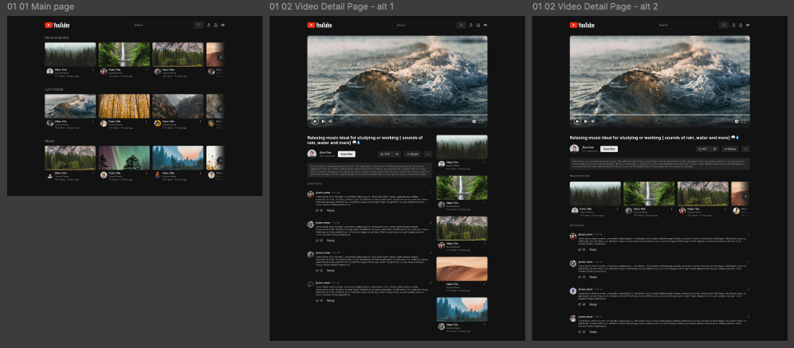

## Laboratorio UX / UI

The goal of this lab is to evaluate the User Interface (UI) and User Experience (UX) of a website we admire, using it as a starting point to analyze how various design and usability patterns are implemented, and to identify potential areas for improvement.

This lab is divided into three distinct parts:
1. Heuristic Analysis
    - Evaluate usability principles, highlighting examples and analyzing how each principle is applied.

2. Application Review and Low-Fidelity Prototyping
    - Assess how the chosen application adheres to Gestalt principles.
    - Propose potential improvements through low-fidelity prototypes.

3. High-Fidelity Redesign
    - Develop a high-fidelity redesign based on identified improvements.
    - Use Figma as the main tool, leveraging its features such as variables, components, and more.

You can view the project and designs [here on Figma](https://www.figma.com/design/kNGLHhfRH5E3IynmdL6TXQ/LemonCode---UX-module?node-id=1-3&t=TnZjF7bssEAkVhcm-1).

### 📝 Author & License
Solution by [@sergio-jc](https://github.com/sergio-jc), exercise from [Lemoncode](https://lemoncode.net/). See the [LICENSE](https://github.com/sergio-jc/master-frontend/blob/main/LICENSE) file for more details.

