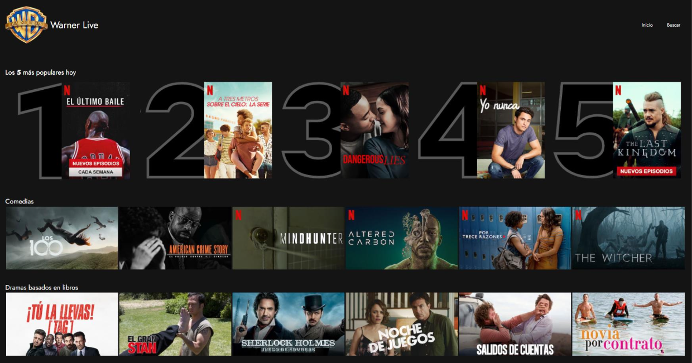
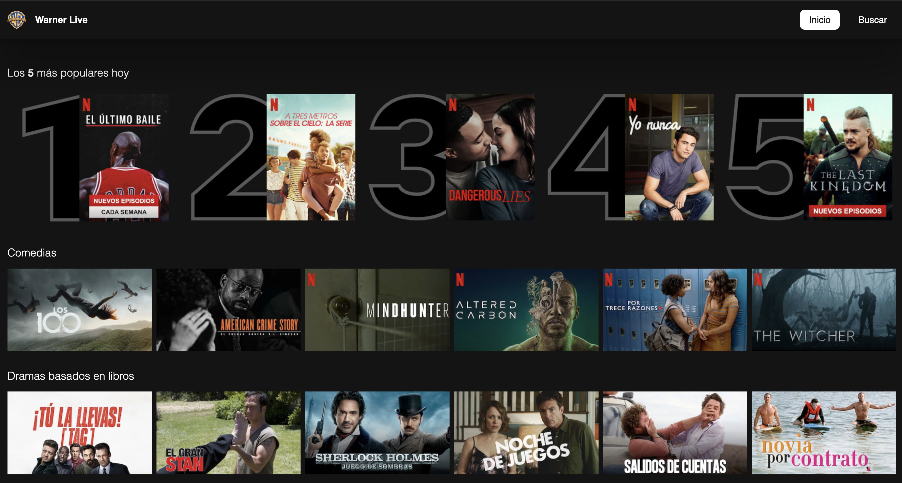
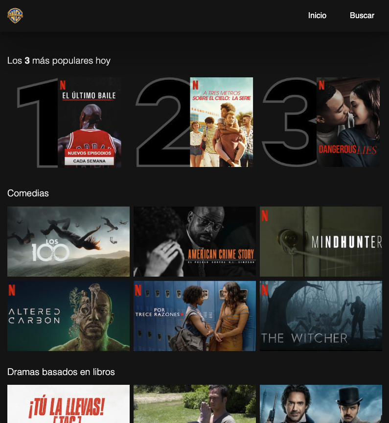

## Exercise 01 - Create a movie app


### 🎯 Objective

Create a responsive design of a movie app:
- Design a web page to show a list of movies with their respective posters.
- The design must be responsive, which means that the design must adapt to different screen sizes.

### 🏠 Technologies
Languages used:
- HTML
- CSS

### ✅ Result

Desktop:


Mobile/Tablet:


### 💻 How to run
Clone the repository:
```bash 
git clone https://github.com/sergio-jc/master-frontend.git
```
Navigate to this exercise:
```bash
cd master-frontend/01-layout/advanced
```

Open the `index.html` file in your favorite web browser. Or use an extension of your favorite editor to open it.

### 📝 Author & License
Solution by [@sergio-jc](https://github.com/sergio-jc), exercise from [Lemoncode](https://lemoncode.net/). See the [LICENSE](https://github.com/sergio-jc/master-frontend/blob/main/LICENSE) file for more details.

