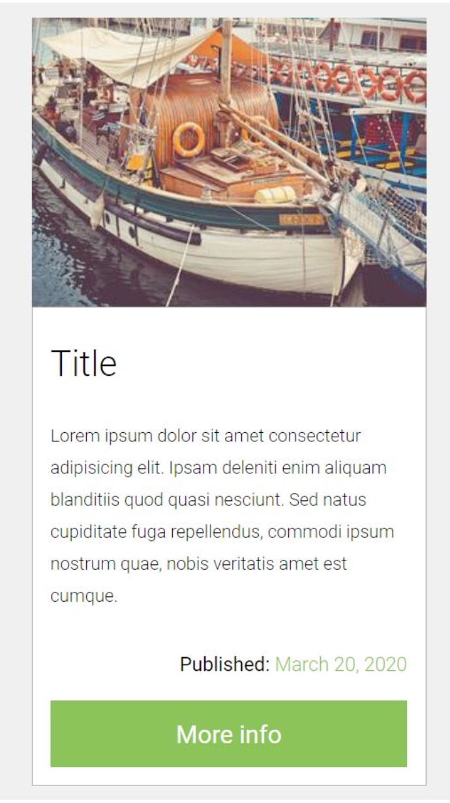
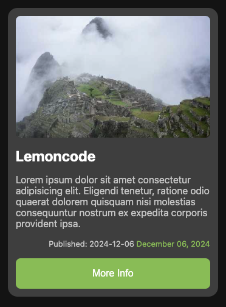

## Exercise 03 - Create a card component


### 🎯 Objective
Create a card component that can be used to display information about a product with CSS Grid.

### 🏠 Technologies
Languages used:
- HTML
- SCSS

### ✅ Result


### 💻 How to run
Clone the repository:
```bash 
git clone https://github.com/sergio-jc/master-frontend.git
```
Navigate to this exercise:
```bash
cd master-frontend/01-layout/basic/exercise-04
```

Install dependencies:
```bash
npm install
```

Run the project:
```bash 
npm run dev
```

Open [http://localhost:5173](http://localhost:5173) with your browser to see the result.

### 📝 Author & License
Solution by [@sergio-jc](https://github.com/sergio-jc), exercise from [Lemoncode](https://lemoncode.net/). See the [LICENSE](https://github.com/sergio-jc/master-frontend/blob/main/LICENSE) file for more details.

