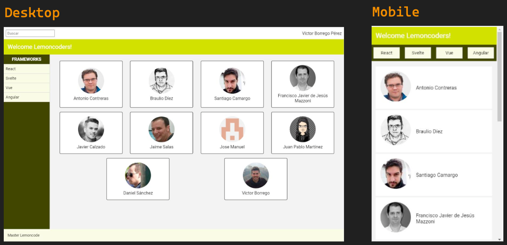
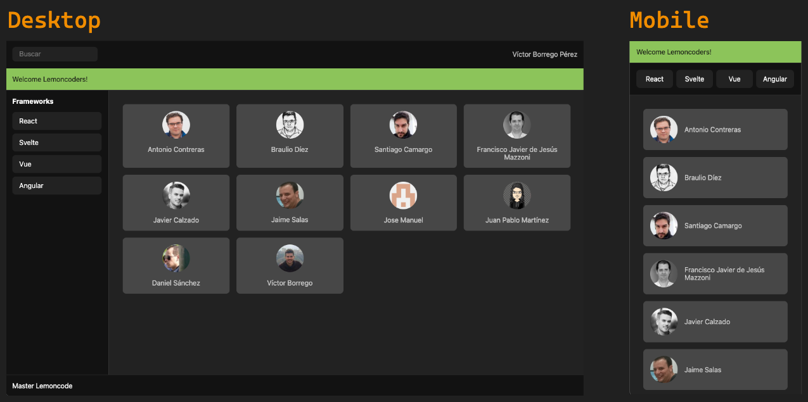

## Extra - Create a complete responsive layout


### 🎯 Objective
We are going to create a Layout for an application, which will contain different responsive components at different screen sizes.

### 🏠 Technologies
Languages used:
- HTML
- CSS

### ✅ Result


### 💻 How to run
Clone the repository:
```bash 
git clone https://github.com/sergio-jc/master-frontend.git
```
Navigate to this exercise:
```bash
cd master-frontend/01-layout/extra
```

Open the `index.html` file in your favorite web browser. Or use an extension of your favorite editor to open it.

### 📝 Author & License
Solution by [@sergio-jc](https://github.com/sergio-jc), exercise from [Lemoncode](https://lemoncode.net/). See the [LICENSE](https://github.com/sergio-jc/master-frontend/blob/main/LICENSE) file for more details.

