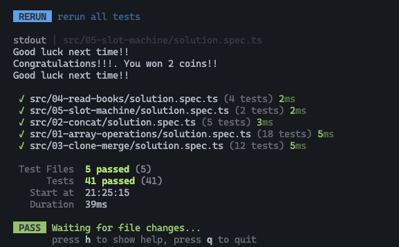

## Laboratory of Languages



### 📘 Overview

This laboratory focuses on modern JavaScript and TypeScript development, applying both fundamental and advanced language concepts commonly used in real-world projects.

Through a set of practical exercises, the lab aims to consolidate knowledge around modern JavaScript features, advanced TypeScript typing (including generics), and clean coding best practices.

As a personal enhancement, the entire laboratory was implemented using TypeScript only and developed following Test-Driven Development (TDD) principles to practice modern testing workflows and ensure solution correctness.

### 🎯 Learning Goals
- Apply core and advanced JavaScript / TypeScript concepts
- Work with generics, custom types, and utility types
- Use modern language features (classes, spread/rest, control flow)
- Reinforce clean code and best practices
- Practice TDD with automated tests

### 📂 Project Structure

All exercises are located inside the src/ directory. Each exercise is isolated and follows the same structure:

```
src/
├── exercise-01/
│   ├── instructions.md
│   ├── solution.ts
│   └── solution.spec.ts
├── exercise-02/
│   ├── instructions.md
│   ├── solution.ts
│   └── solution.spec.ts
└── ...
```

- instructions.md: Exercise description and requirements
- solution.ts: TypeScript implementation
- solution.spec.ts: Tests validating the solution

### 🛠️ Technologies
- TypeScript
- Vite
- Vitest
- pnpm

### 🚀 Getting Started

Installation

```
git clone https://github.com/sergio-jc/master-frontend-labs.git
cd /02-languages
pnpm install
```

Run Tests

```
pnpm test
```

### 📄 Author & License
Solutions by [@sergio-jc](https://github.com/sergio-jc), exercises from [Lemoncode](https://lemoncode.net/). See the [LICENSE](https://github.com/sergio-jc/master-frontend-labs/blob/main/LICENSE) file for more details.
