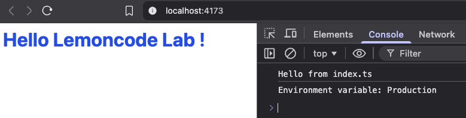

## Laboratory of Bundling



### 📘 Overview

This laboratory is focused on modern web bundling and build tooling. It covers how browsers load and optimize assets, the generation of static files, and key concepts such as hashing, environment-specific builds, and bundle optimization.

The lab explores modern tools like Webpack and Vite, with an emphasis on understanding their workflows, configuration, and real-world usage.

Development and production environments were configured, including bundle size analysis and advanced optimizations such as Gzip and Brotli compression and type checking.

### 🎯 Learning Goals
- Understand core bundling and asset optimization concepts
- Configure development and production build environments
- Work with modern bundling tools (Vite)
- Analyze and optimize bundle size and performance

### 📂 Project Structure

This lab follows a typical project structure, with all application code organized inside the src directory, while index.html, configuration files, and build-related assets are kept at the project root.

```
├── src/
│   ├── ...
│   ├── index.ts
│   └── ...
├── ..
├── package.json
└── ...
```

### 🛠️ Technologies
- TypeScript
- Vite
- pnpm

### 🚀 Getting Started

Installation

```
git clone https://github.com/sergio-jc/master-frontend-labs.git
cd /03-bundling
pnpm install
```

Run dev server

```
pnpm start
```

Run build server

```
pnpm run preview # Generate de bundle
pnpm run build   # Run de build server
```

### 📄 Author & License
Solutions by [@sergio-jc](https://github.com/sergio-jc), exercises from [Lemoncode](https://lemoncode.net/). See the [LICENSE](https://github.com/sergio-jc/master-frontend-labs/blob/main/LICENSE) file for more details.
