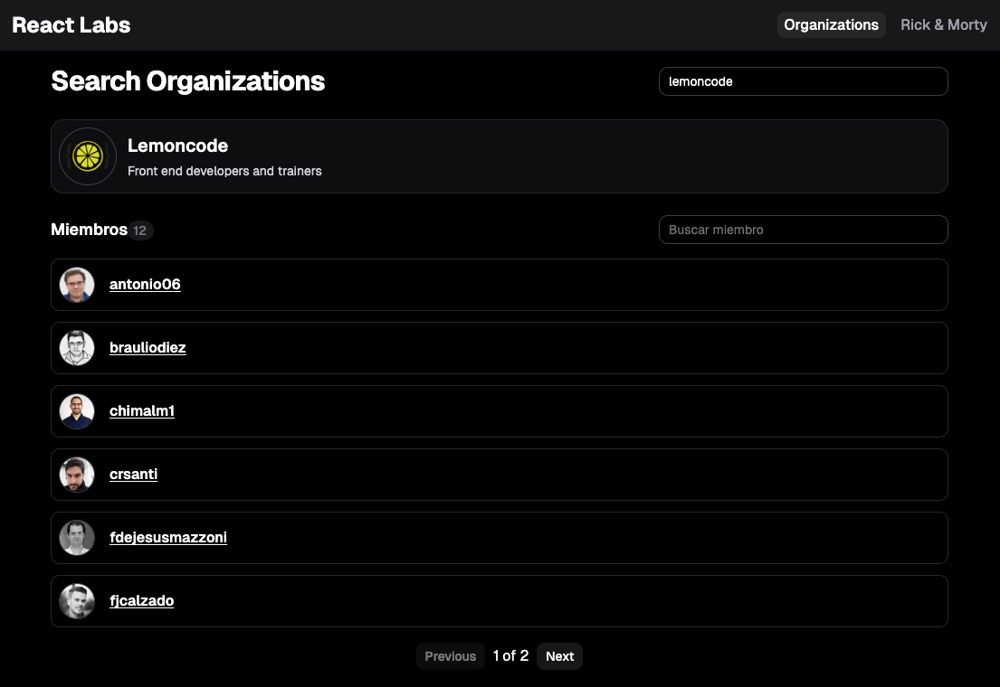
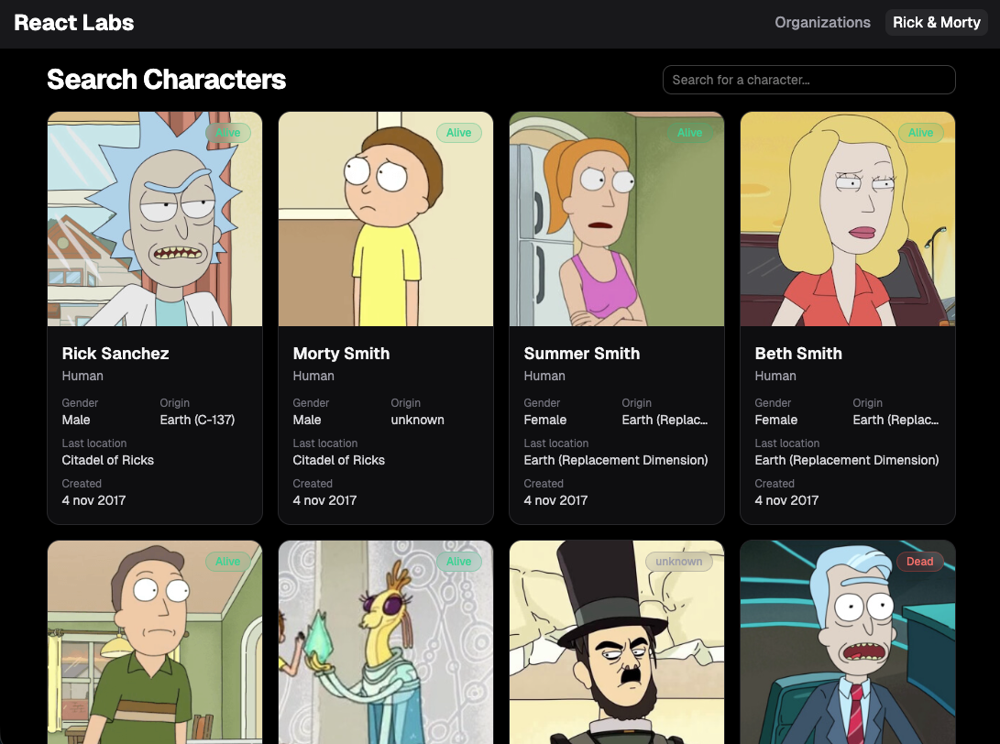

## React Lab

### 📘 Overview

A hands-on lab focused on **React 19** with an emphasis on scalable architecture. Two applications were built within a single project, each consuming a different public API. This allowed working with multi-view routing, URL state management, pagination, debounced search, and a custom component system based on **Shadcn/ui + Tailwind CSS**. The project follows the **Lemoncode pod architecture**, organizing code by functional domain. The lab is split into two levels: basic (minimum required to pass) and extended (optional exercises to go deeper).

> [!Note]
> API rate limits: both applications consume public external APIs, which are subject to usage limits. With heavy usage in a short period of time you may receive a `429 (Too Many Requests)` error. If that happens, wait a few minutes before trying again.

---

### 🗂️ Included Projects

This lab contains two projects implemented within the same application, each as an independent pod:

#### 1. 🔍 GitHub Organization Search



Allows searching for GitHub organizations and browsing their members and member details.

**Implemented features:**
- Default member listing for the `lemoncode` organization
- Search input with `lemoncode` as the default value
- Dynamic search for any organization (e.g. `microsoft`)
- Filter state is preserved when navigating back from a member's detail view
- Results pagination
- Member name filter within the listing

#### 2. 📺 Rick & Morty API



A character explorer for the Rick & Morty series using its public API.

**Implemented features:**
- Character listing
- Character search with **useDebounce**
- Character detail view

---

### 🛠️ Technologies

| Technology | Usage |
|---|---|
| React 19 | Main UI library |
| TypeScript | Static typing |
| Vite 8 | Bundler and dev server |
| React Router 7 | SPA routing |
| Tailwind CSS 4 | Utility-first styling |
| Shadcn/ui | UI component system |
| React Compiler | Automatic render optimization |
| pnpm | Package manager |

---

### 🚀 Getting Started

**Install dependencies**

```bash
git clone https://github.com/sergio-jc/master-frontend-labs.git
cd 04-frameworks/react
pnpm install
```

**Development server**

```bash
pnpm dev
```

**Production build**

```bash
pnpm build       # Type-checks and generates the bundle
pnpm preview     # Serves the generated bundle locally
```

**Navigating the app**

Opening `http://localhost:5173` shows a home screen with two cards, one per lab. You can also navigate directly to each one:

| Lab | Entry URL |
|---|---|
| GitHub Organization Search | `http://localhost:5173/organizations` |
| Rick & Morty | `http://localhost:5173/rick-and-morty` |

---

### 📄 Author & License

Solutions by [@sergio-jc](https://github.com/sergio-jc), exercises from [Lemoncode](https://lemoncode.net/). See the [LICENSE](https://github.com/sergio-jc/master-frontend-labs/blob/main/LICENSE) file for more details.
